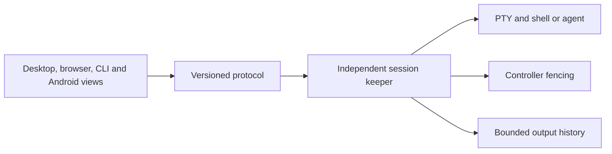

# DOT Terminal

**An open Rust terminal workspace for people and agents, across devices.**

[](https://github.com/dot-protocol/dot-terminal/actions/workflows/ci.yml)
[](LICENSE)

Start work on one machine. Keep the session alive. Return from another interface.
DOT Terminal is building a portable execution and session foundation for macOS,
Linux servers, and Android, with explicit ownership and agent permissions.

**Status: development preview, not a production security boundary.** There is now a
macOS desktop app and local browser view, backed by persistent Rust PTY keepers and
xterm.js. Android can pair by QR invitation and transfer control of the same shell
wirelessly. Existing iTerm sessions have a separate, text-only screen/input bridge.

The desktop includes an encrypted macOS Keychain-backed vault with audited process
launches, and read-only machine measurements reused from AXXIS Resource Manager.
The vault does not keep secrets encrypted inside ordinary child processes or observe
all their later use. Recovery/export, a credential-operation broker, full styled screen
reconstruction, internet relay/discovery, and OS firewall/resource enforcement remain
unfinished. Keep this preview away from untrusted code and valuable credentials.

## Open the desktop (macOS)

Requires Rust, Node.js 22.12+ or newer, Python 3.10+, and Xcode Command Line Tools:

```sh
python3 scripts/build-desktop.py --install --iterm
open "$HOME/Applications/DOT Terminal.app"
```

`--iterm` installs the optional iTerm Python dependency in your local application-support directory. iTerm must be
running with its Python API enabled. New DOT shells work without iTerm.
The **Open in browser** button opens another authenticated local view. The browser
view uses the desktop service; closing the app disconnects views but keeps shells alive.
See [desktop, vault and resource boundaries](docs/desktop.md).

## Try the working foundation

Requires a current stable Rust toolchain and macOS or Linux. Windows runtime and
Android local shell execution are not available yet. No cloud account or API key required.

```sh
git clone https://github.com/dot-protocol/dot-terminal.git
cd dot-terminal
cargo build --locked

# The shell survives after this command exits.
SESSION=$(./target/debug/dot-terminal new -- /bin/sh)
./target/debug/dot-terminal list
./target/debug/dot-terminal attach "$SESSION"
# Press Ctrl-] to detach. Attach again to return.
./target/debug/dot-terminal attach "$SESSION"
./target/debug/dot-terminal stop "$SESSION"
```

An existing CLI agent can be started in place of `/bin/sh`. It retains its normal
host permissions: this keeper is not a sandbox. Sessions started elsewhere are
not automatically adopted.

For explicit takeover between two local terminal windows:

```sh
./target/debug/dot-terminal attach "$SESSION" --takeover
```

The previous controller's subsequent writes and resizes are rejected. A detached
CLI releases control; an abruptly killed client requires explicit takeover.

`read ID --after OFFSET` returns byte history as JSON without rendering escape
sequences. `attach` replays raw bytes through your existing terminal. The Android view uses parsed monochrome
screen snapshots. Advanced keyboard modes, mouse forwarding, terminal query replies,
and graphical color/style rendering are not implemented in the Android snapshot view. The desktop xterm.js renderer supports color and terminal input modes. Full styled reconstruction after history truncation or a view-size change remains unfinished. Use only trusted commands and output.

## What works today

- A macOS desktop window and local browser interface render DOT sessions with xterm.js.
- QR enrollment with possession proof and host confirmation; one-use, expiring session handoff.
- Keychain-backed encrypted vault storage, launch disclosure audit, and read-only resources.
- A detached keeper per session owns the PTY independently of the launching CLI.
- Strict versioned, length-limited control messages over private Unix sockets.
- Controller generations fence stale input and resize requests.
- Ordered input batches deduplicate the last acknowledged request and reject
  conflicting/out-of-order requests. Ambiguous writes are never automatically retried.
- A bounded 1 MiB output ring exposes byte offsets and explicit truncation gaps.
- Exited sessions retain output until stopped; no terminal content is written to disk.
- Private runtime directory (0700), socket permissions (0600), bounded connections,
  and request deadlines. Idle keepers block on I/O rather than poll continuously.
- Alacritty-backed VT state with complete monochrome snapshots for Android reconnect.
- Android JNI protocol validation, command entry, terminal keys, and explicit takeover.
- Android Keystore identity, pinned TLS peers, separate terminal/clipboard grants, and revocation.
- Explicit Mac–Android text clipboard send/receive with one-level Android undo.
  Android background clipboard access is restricted; this is not invisible universal sync.
- [QR pairing and handoff](docs/qr-pairing-handoff.md), [wireless setup](docs/android-app.md) and [mesh design/source research](docs/mesh-and-continuity.md).
- Unit and real-process integration tests; macOS, Linux, and Android build CI.

## Architecture



A reproducible [Android native probe](docs/android.md) exercises the portable core
on a connected ARM64 phone. The same guide covers building and pairing the
[Android development app](docs/android-app.md).

The [architecture](docs/architecture.md) defines the larger system. The
[roadmap](ROADMAP.md) distinguishes implemented behavior from release gates.
The [protocol](docs/protocol.md) describes current failure semantics.

The design draws on AXXIS's independent PTY-holder work and mature upstream
terminal projects. See [reuse decisions](docs/reuse-audit.md) and [NOTICE](NOTICE).
We reuse components where their contracts fit; old product boundaries do not
constrain the new design.

## Build with us

```sh
cargo fmt --all --check
cargo clippy --workspace --all-targets --locked -- -D warnings
cargo test --workspace --locked
```

Contributions with reproductions and measured results are especially valuable:
terminal snapshot correctness, Unicode/input methods, Android lifecycle handling,
slow-client backpressure, and cross-platform process supervision.

Read [CONTRIBUTING](CONTRIBUTING.md), [SECURITY](SECURITY.md), and the
[community guidelines](CODE_OF_CONDUCT.md). No claims of production security,
universal device support, or performance superiority are made by this prototype.

Apache-2.0 for original work; upstream dependencies retain their own licenses.
