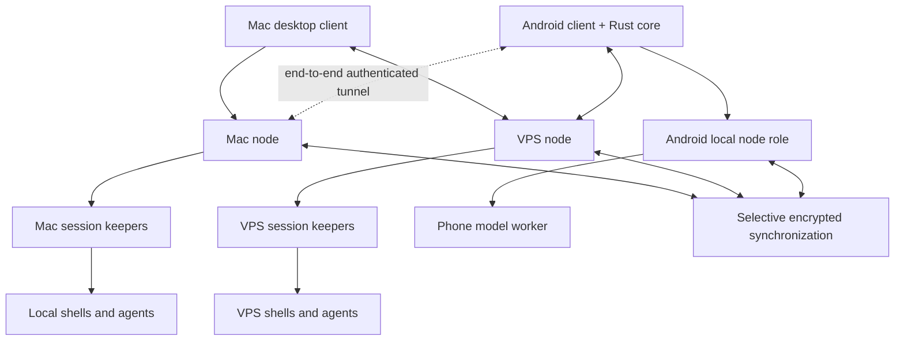

# DOT Terminal — target architecture v0.1

Status: proposed implementation specification, 19 September 2026. This document specifies the new product; it does not claim an implementation, benchmark, security audit, or inspection of existing installations. Product name: DOT Terminal. Some crate names below describe target boundaries; README identifies the implemented subset.

## 1. Product contract

One personal workspace connects a MacBook, Linux VPS, and Android phone. Each can display and control authorized sessions; capable devices can also execute local work. A shell or agent has one execution owner. Changing the viewing device does not migrate the running process.

The first useful experience is: start an agent on the VPS from the Mac; close the Mac application; open Android; see the same live session; explicitly take input control; continue; return to the Mac without duplicating work. Independently, run a small model on Android while offline. On reconnect, synchronize authorized task records, not arbitrary stale keystrokes.

The shared product foundation is Rust. Platform integration can use Swift/Objective-C and Kotlin/JNI where the OS requires it. Existing C/C++ libraries for inference, database encryption, and text rendering may be dependencies. A claim of an entirely Rust dependency tree is not a requirement.

The first release is a terminal and agent workspace, with identity, recovery, permissions, storage, and extension boundaries built in. Commerce, family records, and personal ERP are later modules using those foundations.

## 2. System topology



Each node has a device identity, capability advertisement, authorized workspace memberships, encrypted local state, and bounded execution resources. Equal protocol participation does not imply equal compute or operating-system privileges.

The VPS can be an always-online execution node and optional relay. Those are separate roles: a relay need not decrypt tunneled Mac-to-phone traffic; an execution node necessarily sees ordinary jobs' plaintext while executing them. Hosting a job on a VPS is a trust decision.

Mac sleep pauses Mac execution and connectivity. VPS jobs continue independently. Android suspension can stop local execution; remote jobs continue. There is no automatic failover that restarts arbitrary commands elsewhere.

## 3. Decisions for the first implementation

| Area | Decision | Boundary |
|---|---|---|
| Core | Rust workspace; Tokio for asynchronous I/O | Keep domain/protocol definitions independent of runtime and OS bindings |
| Terminal semantics | Adapt pinned `alacritty_terminal` behind our own interface | Reuse VT parsing/grid behavior; do not expose upstream types on the wire |
| PTY | `portable-pty` on Mac/Linux, later Windows validation | Android process launch needs its own supported implementation or external terminal integration |
| Desktop | Rust window/event handling with `winit`; terminal rendering with `wgpu` | Native bridges for accessibility, input methods, secure storage, notifications |
| Android | Kotlin application shell; Rust shared core through UniFFI/JNI | Lifecycle, IME, permissions, Keystore and microphone remain native integrations |
| Terminal drawing | Shared Rust grid-to-render model; shared GPU renderer where proven | A software/native drawing adapter remains possible for device compatibility |
| Persistence | SQLite with SQLCipher for sensitive local database pages | Integration must verify journals/temp files/backups, not just main-file encryption |
| Transport | Versioned protocol over local IPC and TLS-authenticated remote connections | Reuse SSH for initial administration/tunneling; do not implement a new crypto transport |
| Model execution | Replaceable backend, starting with llama.cpp on Android and desktop | External library through narrow FFI/worker; model weights are separate licensed assets |
| Speech | Later provider interface, first local whisper.cpp candidate | Speech produces an editable draft, never automatic terminal execution |
| Extensions | Typed first-party interfaces initially; Wasmtime plugins later | Plugins receive explicit capabilities; no default arbitrary host access |

Dependency choices are proposals pending pinned-version license, build, and compatibility checks. The first three days include an engine integration spike. If the chosen terminal engine fails essential behavior, evaluate `wezterm-term` behind the same interface before committing to a large fork. Do not maintain two production terminal engines initially.

WezTerm is the main integrated reference for terminal plus multiplexing. Herdr is a reference for session ergonomics and agent state. New identity, node federation, grants, and task records remain our protocol. Reuse through libraries and adapters; maintain an upstream patch ledger and contributions. No merger of unrelated codebases is presumed.

## 4. Process model and ownership

`workspace-node` is a per-user control service. It provides discovery, authorization, metadata, session creation, agent adapters, and client routing. It does not run as root.

`workspace-session` is a separate keeper process for a session. It owns the PTY master, child process group, terminal parser/state, output sequence, input-control lease and bounded replay storage. Killing the desktop client must not kill it. Restarting the control service must not kill it either.

OS service configuration must preserve keepers across control-service restarts: use independently managed units/processes rather than placing them in a service group whose restart kills all children. Reconnection to a keeper uses authenticated local IPC and session identity, not a PID alone.

If the keeper itself dies, arbitrary live PTY state is not promised recoverable. If the machine reboots, process memory is gone. Record interruption, retain authorized history, and offer an explicit agent-native resume or task restart when supported. Restoring a saved transcript is not restoring a process.

Model workers are separately managed for cancellation and resource limits. A local CLI agent and a directly integrated model conversation are different adapter types. Wrapping a CLI in a PTY does not grant control over its internal context assembly.

## 5. User interface model

The sidebar lists workspaces, devices, sessions, and tasks. Every session visibly identifies its execution owner and trust mode. A tab contains a layout tree of splits; leaves display terminal sessions or structured agent conversations. Window positions, touch layouts, font size and zoom are device preferences.

Workspace membership and session references synchronize; desktop pixel geometry does not overwrite the phone layout. A disconnected session remains visible with a stale-state label, last-contact time, and no false indication that it is accepting input.

Multiple clients may observe a session. Exactly one controller lease determines who can type and resize. Taking control is an explicit action. Observers pan/scale the owner's dimensions rather than repeatedly resizing the same PTY. A later collaboration mode may deliberately permit multiple writers, but it is not the default.

Mac input requirements include IME composition, dead keys, key repeat, Option/Command handling, Unicode, selection, copy/paste and accessibility. Android needs a usable soft keyboard, Ctrl/Esc/Tab/navigation keys, physical keyboards, rotation handling, selection handles and TalkBack. These are first-release acceptance requirements, not finishing touches.

The v0.1 terminal support matrix covers UTF-8, combining/wide characters, true color, alternate screen, cursor and erase behavior, bracketed paste, standard mouse reporting, hyperlinks and resize. Advanced keyboard and image protocols are advertised only after conformance testing. OSC clipboard writes and other terminal-originated host effects require policy checks. Pasted multi-line commands are visibly reviewable.

## 6. Protocol and failure semantics

Use a versioned control envelope and separate bounded binary data frames. Initial control encoding can be JSON for debugging; stream frames carry bytes or versioned terminal updates without base64 inflation. TLS provides transport authentication/integrity; signed portable grants/receipts are a separately reviewed feature, not home-grown transport cryptography.

An envelope contains protocol version, request ID, sender device, workspace, resource ID, resource epoch, operation type and payload. Authority is derived from authenticated identity plus current grants, never trusted solely because these identifiers appear in a message.

Core operations: negotiate capabilities, list nodes/workspaces/sessions, create session, attach, acquire/release control, resize, submit input, fetch history, cancel/terminate, list agent tasks, and subscribe to events. Terminating a session is distinct from detaching.

Session creation has an idempotency key persisted before acknowledgement. Session IDs remain stable across view changes. Keeper generations prevent stale clients from addressing a replacement process as though it were the original one.

Output carries monotonically increasing per-session sequence numbers. Attach returns a terminal snapshot at a defined sequence boundary followed by ordered deltas. Snapshots cover visible cells, attributes, cursor, relevant modes and dimensions; scrollback is paged separately. Internal parser checkpoints, if persisted, are version-specific and never treated as a stable interchange format.

The owner parses terminal control sequences. GUI clients draw its terminal model rather than independently interpreting raw output into potentially different states. The bootstrap CLI has a controlled terminal redraw adapter. Never assume that replaying the last N output bytes reconstructs an arbitrary full-screen program.

Controller leases use generation/fencing tokens enforced at the keeper. Lease expiry uses the owner's monotonic clock. Old input and resize requests are rejected after handoff. Reconnect does not silently reacquire control.

Input batches have IDs and acknowledgements distinguishing received, written, rejected and outcome-unknown. Deduplication prevents normal reconnect retransmission. A crash between writing to a PTY and persisting acknowledgement leaves an unavoidable uncertainty: a PTY write and a database commit are not one transaction. Never automatically resend an ambiguous command. Exactly-once external side effects are not promised.

Slow clients cannot stall the owning process indefinitely. Bound queues; coalesce visual updates; provide fresh snapshots or explicit history-gap markers when necessary. Limit frame sizes, dimensions, scrollback, subscriptions and decompression ratios. Fuzz parsers and malformed protocol input.

Backward compatibility target: current and previous protocol version during rolling upgrades. Negotiate optional features; reject unsupported operations explicitly. Breaking history/schema changes require tested export and rollback paths.

## 7. Connectivity and enrollment

First setup: create the personal workspace on the Mac, create a recovery kit, and provision a separately identified VPS node over the user's existing trusted SSH administration channel. Do not copy an existing SSH private key to other devices.

Phone enrollment uses a short-lived, one-use invitation plus out-of-band fingerprint verification on the already trusted device. Each device creates its own key; enrollment grants explicit workspace roles. QR possession alone must not confer unlimited access without the intended enrollment confirmation.

Use a standard TLS library and device certificates tied to the workspace trust configuration. Private trust-root material is encrypted and separate from daily device credentials; enrollment and rotation require an authorized enrollment role. Certificate/key storage must be designed for platform capabilities, not assumed hardware-backed everywhere.

Phase one uses direct connections to the VPS and outbound Mac tunnels when required. The Mac listens locally by default. A VPS relay forwards an inner authenticated encrypted channel to the Mac; it must not terminate that channel if confidentiality from the relay is claimed. NAT traversal, QUIC and a discovery mesh are future transport optimizations, not prerequisites.

The directory records signed/verified device identity, advertised capabilities and last observation. Offline status is uncertain connectivity, not proof of death. Trust does not follow automatically from sharing a LAN or private overlay network.

Revocation increments membership/grant revisions, closes active sessions where reachable, and fences new operations. Disconnected nodes can retain stale authority; sensitive offline grants need explicit expiry and reconciliation policy. Do not claim instant global revocation across a partition.

## 8. Identity, permissions and recovery

Separate person/workspace identity, device identities, execution-node identities, agent identities and provider accounts. Linking a provider account establishes a scoped relationship; it does not merge every record or transfer ownership. Agents never inherit the entire user's authority by default.

Permission resources include workspace, session, directory, provider credential, model endpoint, history collection, microphone and network destination. Operations include view, control, spawn, read, write, export, delegate and administer. Grants contain scope, issuer, subject, expiry and revocation revision; delegation cannot widen scope.

v0.1 provides local runtime enforcement and exportable authority records. A stable, interoperable signed-grant format is designed and reviewed before third-party federation. Use established encodings/signature standards; do not invent a cipher or assume arbitrary JSON has one canonical signing representation.

Device secrets use macOS Keychain and Android Keystore integration where supported. Android hardware protection varies by device. Distinguish an unexportable device key from recoverable encrypted data keys. Never promise to back up a hardware-bound private key that cannot be exported.

Recovery has four separately tested paths: add a new device using a trusted device; replace a lost device and revoke it; recover workspace identity from an offline recovery kit; decrypt an encrypted backup. Losing every trusted device and every recovery secret means encrypted data may be unrecoverable. No hidden vendor master key.

A VPS may require unattended access to its execution-store key. Document that this reduces protection against a live host compromise. A relay-only store can hold ciphertext without those keys. Account recovery, key recovery and node administration are not equivalent.

Export includes documented manifests, object/schema versions, authorized records, encrypted attachments, provenance, and verification instructions. Exportable provider credentials are opt-in; hardware keys are represented by replacement/reenrollment instructions. An actual restore on a clean device is a release gate.

## 9. Data model, retention and synchronization

Initial entities: Workspace, Principal, Device, Grant, Session, AgentTask, Message, Artifact, ProviderBinding, ModelProfile, Event, Checkpoint and BackupManifest. A session is an execution resource; a task can span several sessions. A message is structured content, not a slice of terminal screen text.

Each durable event records schema version, unique ID, owner sequence, author, causal parents where needed, resource revision, event type and encrypted payload. Wall-clock timestamps aid display; sequence/revision determines ordering at an owner. Do not create a global total order for every person's record.

Use SQLCipher locally; put blobs in authenticated encrypted objects with random IDs and explicit key versions. Avoid plaintext-content hashes in untrusted indexes unless the equality leakage is intentional. Do not claim encryption hides sizes, access timing, IP addresses or all identifiers.

Synchronize selected metadata and selected task content by explicit collection grants. Secrets are not copied merely because devices are paired. Terminal content is not automatically uploaded, embedded or sent to models. Raw keystroke logging is off; terminal output can itself contain secrets, so recording has visible per-session controls and retention limits.

Initial quotas: bounded live replay and scrollback, per-session history limits, and workspace disk quotas. Exact defaults follow measured workloads. Overflow surfaces a gap or quota error; it must not silently corrupt the record. Explicit export remains separate from routine caches.

v0.1 treats execution state and permissions as owner-authoritative. Device-local view preferences remain local. Shared task edits use revisions and explicit conflicts. Add CRDT collaboration to specific document types later; do not use last-writer-wins for grants, execution, money or consent.

Migrations are transactional with schema compatibility checks and pre-migration backup. Preserve original signed material; migrations create derived views rather than rewriting the statement that was signed. Replica convergence is not backup: backups have retention, verification and independently exercised restoration.

Deletion removes local material and propagates authorized tombstones. Copies already exported or learned by another party cannot be remotely erased by promise. Retention rules cover backups, terminal history, embeddings and model caches.

## 10. Agents, context and small models

Two adapter classes ship: TerminalAgent for existing interactive CLI tools, and StructuredAgent for APIs/local model backends with explicit messages, tool calls and outcomes. Agent state reports identify their evidence source: process observation, output heuristic, or native integration. A heuristic 'done' is not a verified task result.

Context assembly path: user input -> destination/intent selection -> permission-filtered retrieval -> context budget -> user-visible provider/data policy -> model invocation -> proposed tools -> independent policy enforcement -> execution -> durable result.

A small local model may suggest routing, summarize, classify, and search. It cannot issue itself new grants. Deterministic policy governs secrets, cloud transmission, directory access and spending. Retrieved files and terminal output are untrusted content, not new user instructions.

Each task records chosen model/provider, relevant context references, tool requests/results, budget and resume metadata where supported. Model output and summaries are derived records. Keep original authorized evidence accessible. Native context management does not pretend to control a third-party CLI's private internals.

Confirmed user target: Motorola Moto G67 Power 5G. Motorola's corresponding support specification lists Snapdragon 7s Gen 2 and an 8 GB physical-RAM configuration; regional/storage/RAM variants exist, so inspect the actual device before treating this as its measured configuration. RAM Boost is not additional physical RAM and must not be counted as equivalent model memory. The similarly named Moto G67 has different specifications.

Android first experiment: a licensed, quantized model in approximately the 0.5–2B parameter class using llama.cpp. Start with a roughly 1B model at 4-bit quantization and a bounded 2K–4K context as an experiment, not a promised performance tier. Choose the exact model after actual RAM/SoC/OS measurement. Account for weights, KV cache, runtime buffers and app overhead; weight size alone is not the memory budget. Establish a CPU baseline before testing available GPU acceleration; do not assume advertised NPU capability is usable by the chosen runtime.

Measure cold load, first-token latency, tokens/second, peak memory, temperature and battery during a sustained workload. Provide cancel/unload, context limits, and a resource monitor. Local intent routing is the initial target; reliable autonomous coding on a small phone model is not assumed.

Long-running tasks default to the VPS when explicitly placed there. Switching from local to cloud inference requires the applicable data-sharing policy; it is never a silent response to local slowness.

## 11. Android execution contract

Android is a first-class client and a constrained execution node. The MVP includes remote terminal control and in-app local inference. A minimal app-scoped shell/process capability can be evaluated, but a desktop Linux package environment is a separate feature requiring Android-compatible binaries and distribution decisions.

An optional Termux bridge is an interoperability route, not an assumption that a normal Android app can execute arbitrary desktop Linux programs. No rooting requirement. Validate Android API level, distribution rules, executable storage and native-library loading before promising a bundled general package manager.

Long-lived local work is user-visible and must comply with Android background/foreground-service restrictions. A foreground service does not guarantee immortality or unlimited background inference. Persist resumable task state and handle process death, low-memory eviction, network changes and battery restrictions. After OS kill, show interruption honestly.

The shared core supports Android through library embedding; it need not run as a permanent Unix daemon. Avoid busy polling or keeping a radio awake merely to show a stale session list. When the app resumes, obtain fresh leases, revisions and snapshots.

## 12. Execution safety and extensions

Trust modes are visible: host-trusted process, OS-sandboxed process, and remote execution. A PTY itself is not an isolation boundary. The first dogfood version may run user-authorized local CLIs with ordinary user privileges, explicitly labeled; it must not market these as sandboxed.

The execution-provider interface specifies image/environment, allowed mounts, network rules, CPU/RAM/disk/time budgets, secret references, persistence, and cancellation. Add one local isolation backend and one VPS microVM/container backend before third-party untrusted tools. Backend choice determines the actual guarantees.

Keep the privileged policy/credential broker outside agent-controlled processes. Prefer scoped credential use through a broker over exposing reusable API keys inside a shell. Host isolation does not imply confidentiality from the host administrator.

Speech, notifications, retrieval, file views, model backends and future personal/business applications attach through typed services. Plugins have signed/versioned manifests, explicit requested permissions and versioned APIs. Wasm limits code execution; authorized host functions must still enforce policy and resource budgets.

The core is a personal runtime above macOS/Linux/Android, not a replacement OS kernel. Full-device firewall behavior requires the relevant OS integrations and privileges and is not implied by controlling this app's network requests.

## 13. Future modules and integration boundaries

Stable primitives for later modules: identity and membership, scoped delegation, typed artifacts, commitments, event provenance, selective sharing, revocation, export and conflict/dispute records.

Personal records and family collaboration get separate permission domains. Commerce modules add offer, accepted commitment, fulfilment assertion, acknowledgment, inspection, dispute and settlement. CRM/ERP modules own their business invariants. They do not receive unrestricted SQL access to personal vaults.

Solid or external storage can be connected through adapters. Blockchains may provide settlement or commitments for selected workflows. Neither is required for terminal operation, device pairing or local task history. Formal verification targets precise grant/state-machine properties; it does not certify arbitrary real-world claims.

Existing AXXIS or other local infrastructure should remain untouched until its live contracts are inventoried. The new specification is not authorization to overwrite installed services. A migration/import adapter must reconcile IDs, sessions and permissions; do not run two uncontrolled owners of the same session.

## 14. Proposed repository boundaries

```text
crates/
  protocol/       Wire types, schema versions, capability negotiation
  core/           Domain IDs, grants, task/session state machines
  node/           Control service and authenticated dispatch
  session/        Keeper, PTY adapters, lease enforcement
  terminal/       Upstream engine adapter, snapshots, input encoding
  transport/      Local IPC, TLS framing, relay/tunnel adapters
  store/          Encryption bindings, events, migrations, export
  agents/         CLI/API adapters, context assembly, tool boundaries
  client/         Shared client state, subscriptions, reconnection
  render/         Terminal text/layout/rendering abstraction
  platform/       Narrow platform-specific integrations
apps/
  cli/            Bootstrap operation and attach client
  desktop/        Rust desktop application
  android/        Android shell + Rust integration
spec/             Protocol, threat model, compatibility and ADRs
tests/            Conformance, network faults, recovery, lifecycle
```

These are logical boundaries. Merge trivial crates initially rather than building empty scaffolding. Protocol/core must not depend on the renderer, Android runtime, model implementation or a cloud provider.

## 15. Build sequence and owners

Planning assumption: three experienced engineers (Rust runtime; terminal/desktop; Android) with shared security/reliability review. Estimates are engineering planning ranges, not promises derived from generated-code volume. With one engineer/operator, keep the gates and expect a longer schedule. Agents can implement bounded pieces; ownership and device testing remain explicit.

| Stage | Target window | Owner | Reviewable exit condition |
|---|---|---|---|
| Foundation decisions | Days 1–3 | Runtime + platform owners | Inventory real devices; pin dependency/license candidates; terminal/PTY/render and Android model build spikes; protocol/threat model committed |
| Persistent runtime | Weeks 1–2 | Rust runtime | Create/list/attach/detach local and VPS sessions through bootstrap client; quit UI and restart control service without killing healthy keepers |
| Three-device vertical slice | Weeks 2–4 | Runtime + Android | Android pairs, views VPS session, takes control, reconnects after network change; offline local model produces a bounded response |
| Daily-use desktop and phone | Weeks 4–8 | Desktop + Android | Our desktop terminal supports tabs/splits/search; phone keyboard works; owner labels, leases, encrypted storage, enrollment/revocation and basic export/restore work |
| Agent and safety integration | Weeks 8–10 | Runtime + review | Structured task adapter, scoped tools, permission-filtered context, resource limits, first isolation backend; no ambient cloud context upload |
| Private alpha hardening | Weeks 10–12+ | All owners | Fault matrix passes on actual devices, accessibility review, signed packages, rollback/restore drill, documented limitations |
| Extensions | After alpha gates | Feature owner | Speech drafts, richer window management, additional models and business modules use public interfaces |

Custom rendering, mobile input, accessibility and terminal compatibility are schedule risks. If they exceed the target, keep the usable bootstrap client and reduce visual scope; do not compromise ownership/recovery semantics to meet a date. A polished universal terminal is a longer project than the first private alpha.

## 16. First-release acceptance matrix

1. Start a VPS task from the Mac, quit the Mac app, and continue the same process from Android. Verify by task behavior and keeper/process identity, not a recreated transcript.
2. Restart the control daemon while a keeper owns a live session. Reattach and verify the running job survived. Separately kill the keeper and verify honest interruption reporting.
3. Lose the network immediately before and after input writes. Observe no silent replay of ambiguous actions; surface outcome-unknown where warranted.
4. Take control from another device; stale writer and resize requests are rejected at the keeper. Replayed enrollment invitations and revoked credentials are rejected where current revocation state is available.
5. Run real full-screen programs, shells and at least two agent CLIs; exercise Unicode, resize, alternate screen, paste, keyboard shortcuts and high-volume output on the actual clients.
6. Slow or malicious clients cannot grow memory without bound. Corrupt frames and escape sequences cannot bypass clipboard or host-effect policies.
7. Reboot each host; interrupted sessions remain recognizable, and resumable agents restart only through their documented mechanism. No claim of generic live process recovery.
8. Put Android through rotation, app backgrounding, force-stop, low-memory eviction, airplane mode and network switching. Remote jobs survive; local task status reflects actual lifecycle.
9. Demonstrate local Android inference with network disabled; record model license, peak memory, latency, throughput and sustained thermal behavior.
10. Restore an encrypted export on a clean device using the recovery kit; rotate/revoke the old device; verify access boundaries and history integrity. Verify migration rollback against a real prior-version fixture.
11. Inspect network traffic and logs to confirm terminal content and secrets are not sent to unselected model providers. Check journals, caches and backups for unintended plaintext.
12. Install signed release artifacts on a clean Mac and Android device and the target VPS. Exercise the complete workflow on those exact builds.

Suggested initial performance goals, to calibrate on declared hardware: p95 local key-to-paint under 30 ms; remote processing overhead under 30 ms beyond network/queue latency; interactive reattach within 2 seconds on a healthy tested link; no continuous busy polling when idle. Report workload and device details with all measurements. These are targets, not current results.

## 17. Commons and release governance

Proposed license for original code: Apache-2.0, subject to owner adoption and dependency compatibility review. Preserve upstream notices, licenses, trademarks and provenance. Public source does not automatically establish reuse rights. Inspect pinned dependencies and model licenses before shipping.

Publish protocol schemas, conformance fixtures, architecture decisions, contribution guidance, security reporting process and version policy. Use a DCO-style contribution process and transparent maintainer roles. Export and self-hosting must remain functional without the founding company.

Release CI builds Mac and Linux artifacts and Android native bindings; compile-check Windows-oriented portable boundaries early. Full Windows and Linux desktop support require their own runtime/input tests and are later delivery milestones, not inferred from successful Rust compilation.

Pin dependencies; minimize unsafe code and FFI surfaces; scan licenses/advisories; produce SBOMs and signed artifacts. Updates cannot silently erase sessions or migrate encrypted data without a tested restoration path. No content telemetry by default; crash reports exclude terminal text, prompts and secrets unless deliberately included by the user.

## 18. Decisions still requiring measurements

The phone model is confirmed as Moto G67 Power 5G; actual physical RAM and installed OS still need inspection. VPS architecture/RAM/distribution and any GPU remain unknown. Other pending decisions: desktop accessibility and text shaping approach; supported Android distribution channel; exact terminal engine dependency commit and exposed mode support; idle resource budgets; recovery UX; initial sandbox backend. These do not block the topology or ownership contracts, but must be resolved before promising performance or broad compatibility.

## Primary implementation references

- Alacritty terminal library: https://docs.rs/alacritty_terminal/latest/alacritty_terminal/
- WezTerm source and multiplexing reference: https://github.com/wezterm/wezterm
- Portable PTY: https://docs.rs/portable-pty/latest/portable_pty/
- wgpu: https://wgpu.rs/
- winit: https://docs.rs/winit/latest/winit/
- UniFFI: https://github.com/mozilla/uniffi-rs
- SQLCipher: https://www.zetetic.net/sqlcipher/
- Android foreground services: https://developer.android.com/develop/background-work/services/fgs
- Android Keystore: https://developer.android.com/privacy-and-security/keystore
- Moto G67 Power hardware specification (confirm actual variant): https://en-us.support.motorola.com/app/answers/detail/a_id/191004
- llama.cpp Android: https://github.com/ggml-org/llama.cpp/blob/master/docs/android.md
- whisper.cpp: https://github.com/ggml-org/whisper.cpp
- Herdr: https://github.com/motionharvest/herdr
- OpenSandbox: https://github.com/opensandbox-group/OpenSandbox

References verified 19 September 2026; dependency APIs and licenses must still be pinned and checked during implementation.
