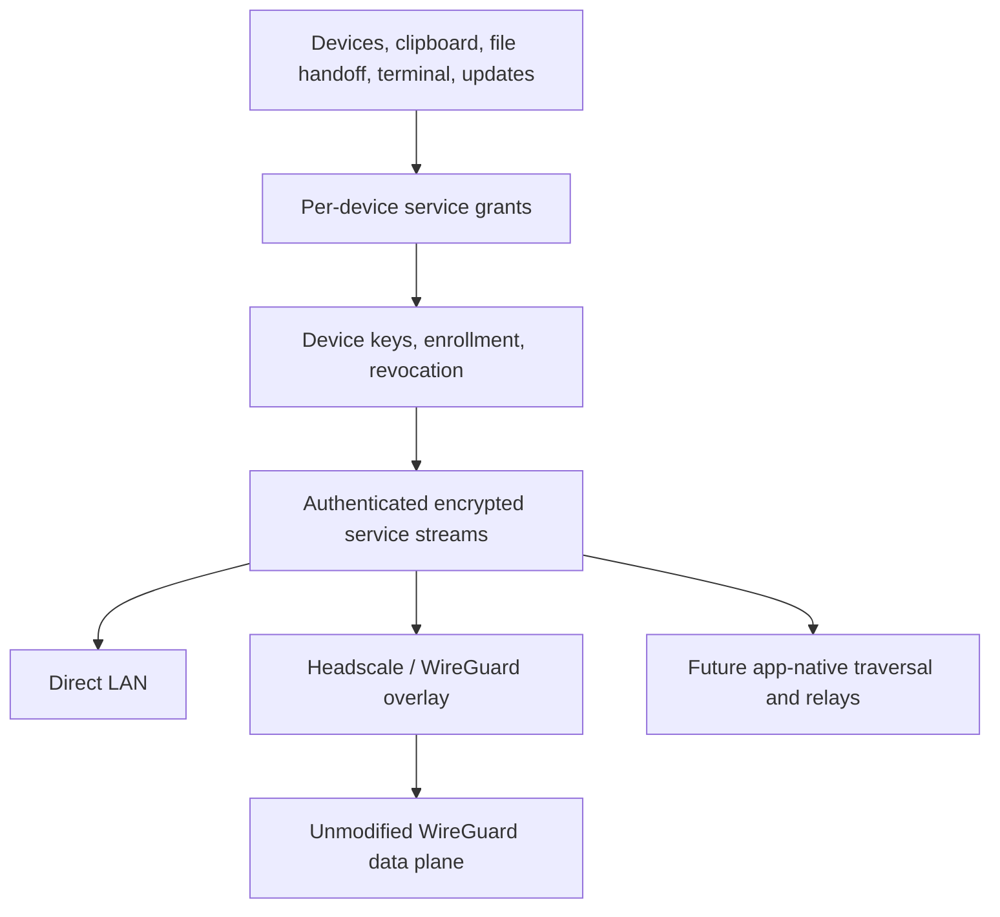

# Device mesh and continuity

Decision record, 2026-09-19. USB is a development/bootstrap mechanism. Wireless
operation, clipboard, file handoff and signed updates are product requirements.
The current implementation is an authenticated LAN service connection, not a
finished mesh, VPN replacement, AirDrop clone, or production update channel.

## Architecture

Identity is a key, not a MAC address, phone number, account provider, hostname,
USB serial or IP address. The implemented device identifier is
`dot:node:v1:<SHA256 of DER SubjectPublicKeyInfo>`. Aliases such as `moto` are local
names, not global ownership claims. Future addresses such as
`dot://<node-id>/terminal/<session-id>` bind a service to its owner. Friendly names
must resolve through an authenticated local registry; discovery is never proof
of identity. Key replacement creates a new key identity and requires an explicit
approved succession record rather than silently reusing the old name.

The Android key is generated in Android Keystore and accessed for TLS signatures.
The Mac development node keeps its key in an owned 0700 directory and a 0600 file;
Keychain integration is a release gate. Debug enrollment exchanges public
certificates over authorized adb. Both endpoints authenticate over TLS; the app
pins the exact server certificate and the gateway pins enrolled client certificates.
TLS certificate validation is not delegated to an untrusted network name.

The node reloads peer grants, limits concurrent connections and frame sizes, and
forwards terminal requests to one specified local keeper. It does not grant the
peer arbitrary keeper discovery, shell creation or shutdown. Terminal access,
clipboard reads and clipboard writes are independent grants. An in-flight action
already authorized may finish during revocation; revocation is not undo.

## Unified clipboard is an explicit service

The implemented Android actions are **Send clipboard** and **Get clipboard** for
text, with a 64 KiB UTF-8 limit. Nothing automatically pastes remote clipboard
content into a shell. Marked-sensitive Android clips are refused. No transcript,
clipboard journal or cloud copy is created by this service. These guarantees do
not extend to the OS clipboard, keyboard, clipboard managers or endpoint malware.
Mac clipboard reads cannot reliably identify every password or sensitive item.

A full continuity service adds per-device subscriptions, item IDs, originating
device, MIME type, expiration, loop suppression, local change counters, and
explicit conflict handling. It must not arbitrarily use wall-clock last-write-wins.
Default scope is the user's selected trusted devices, not every mesh member or
agent. Receiving a clipboard grant is not authority to forward to other peers.
Rich files/images need separate bounded transfer handling and previews.

Android normally restricts background clipboard reads to the focused app or
selected input method. A foreground service alone does not bypass this. We will
support foreground sharing and the Android share UI, then evaluate an optional
DOT keyboard. We will not require root, accessibility scraping or a custom OS
just to promise automatic clipboard capture. iOS and macOS also need platform-
specific permission, lifecycle and distribution work; universal means a shared
contract with honest platform limits, not identical privileges everywhere.

## AirDrop-style transfer

Separate discovery, identity verification, consent and payload transfer. Proposed
flow: select a verified device; send a metadata offer; recipient accepts a bounded
set of files; transfer encrypted chunks with hashes and resume cursors; verify the
complete object; commit atomically to a user-selected destination. Filenames are
untrusted labels, never paths. Constrain extraction, symlinks, file counts, quotas,
preview parsing and disk use. Content hashes prove byte integrity, not truth,
safety, possession rights or delivery to a particular human.

Learn from LocalSend's discovery and transfer offer protocol, and KDE Connect's
platform adapters and continuity UI. Nearby availability must not depend on a
cloud login. Cross-network delivery can reuse authenticated relay paths, with
metadata exposure explained. BLE is useful for discovery/bootstrap; bulk transfers
prefer Wi-Fi or another appropriate data path. Native AirDrop interoperability is
a separate project, not implied by a similar experience.

## Open-source candidates inspected

| Component | License evidence at inspected revision | Role / limitation |
|---|---|---|
| Tailscale open client repository | BSD-3-Clause root | Existing WireGuard client/daemon and traversal; not the entire hosted product |
| Headscale | BSD-3-Clause root | Self-hosted Tailscale coordination; narrow single-tailnet scope |
| NetBird | BSD-3-Clause client/root, AGPLv3 management/signal/relay/combined directories | Integrated alternative; preserve service-specific terms; some enterprise features are commercial |
| EasyTier | LGPLv3 root | Rust mesh candidate; assess embedding/distribution obligations and mobile fit |
| iroh | MIT or Apache-2.0 roots | Rust application QUIC with peer identities and traversal; not an IP VPN |
| wireguard-go | MIT root | Userspace WireGuard implementation; not a discovery/control plane |
| BoringTun | BSD-3-Clause root | Rust userspace WireGuard candidate; validate maintenance/platform/performance before selection |
| LocalSend | Apache-2.0 app root | Cross-platform nearby sharing; protocol compatibility needs a separate adapter |
| KDE Connect | Mixed SPDX licenses in LICENSES | Study platform behavior; inspect each imported file, not just a repository-wide label |

The exact revisions and inspected files are recorded in
[the audit](validation/mesh-source-audit.json). These are source-selection notes,
not a full transitive dependency or distribution audit. No candidate code was
copied into DOT by this research. The fork preserves upstream license/history;
no affiliation or endorsement is implied.

## Network strategy and fork

A history-preserving Headscale fork lives at https://github.com/dot-protocol/headscale.
It is currently an unmodified upstream baseline. Headscale replaces Tailscale's
control server, not WireGuard itself or every Tailscale GUI. Its documented scope
is one tailnet for personal/small-organization use. Our first integration should
use its existing API/configuration before carrying core patches.

DOT services must work over ordinary IP as well as an overlay. A mobile app can
use application TLS/QUIC without becoming the phone's sole active VPN. Headscale
with Tailscale's open client engine is the initial IP-mesh evaluation baseline.
NetBird is an alternative integrated control plane; EasyTier is a Rust mesh
candidate. iroh is an app-native QUIC/NAT-traversal alternative, not a WireGuard
VPN. Select after measured Android background, handoff, relay and failure tests.
No dependency on any of those candidates is added by this decision record.

First fork/integration improvements to evaluate:

1. Pair devices through one clear ceremony, expose the scope being granted,
   authenticate the keys, and reject replayed/expired invitations.
2. Separate stable identity and service names from changing addresses. Display
   direct/relay/offline/blocked accurately, including why a connection failed.
3. Make revocation, lost phones, recovery and coordinator migration ordinary UI.
   Coordinator compromise must not silently enroll an impersonating device.
4. Support owner-hosted relay/discovery, exports, backups and deterministic restores.
   Relay bandwidth and uptime still cost money; peer-to-peer does not eliminate them.
5. Add actionable diagnostics for NAT/CGNAT, IPv6, DNS, MTU, blocked UDP and route
   conflicts. Verify existing peer connectivity during control-plane outages.
6. Measure mobile idle power, reconnection, path selection and relay usage. Keep
   protocol changes compatible and submit appropriate fixes upstream under their
   contribution policy. Do not present a fork as independently invented code.

WireGuard deliberately leaves enrollment, key distribution, naming, most NAT
orchestration and application authorization above its small encrypted IP tunnel.
Improve those layers first. Benchmark packet batching, MTU/path diagnostics,
userspace/kernel transitions and power-aware keepalives before proposing changes.
Do not invent replacement ciphers, weaken verification or call a different tunnel
WireGuard-compatible without interoperability tests. Its optional preshared key
can supplement secrecy but is not by itself a complete forward-secure
post-quantum enrollment/rotation system. Such work requires a reviewed composition.

## Updates and recovery

Wireless transfer of an APK is not a secure updater. Release signing identity is
separate from device identity and relay identity. Adopt reviewed TUF-style signed
metadata, hashes, version/rollback protection, bounded downloads, staged installs,
explicit channels and key rotation. Preserve Android package signing continuity;
ordinary installs may require the OS confirmation UI. A mesh connection is not a
permission to silently install arbitrary code. This updater is not implemented.

Recovery has distinct levels: losing an endpoint key, losing every device, losing
the coordinator, and losing release keys. An owner recovery authority can enroll
a replacement; it must not copy an inaccessible hardware key or revive a revoked
one. Encrypted exports, recovery shares, succession records and grant migration
need end-to-end restore tests before production claims. The current prototype
requires explicit re-enrollment after app-data/key loss.

## Acceptance gates

- A phone command reaches the same keeper using Wi-Fi with adb reverse removed.
- Missing, unknown, changed and revoked device identities cannot invoke services.
- Terminal-only peers cannot read/write clipboard; copied text never executes.
- Clipboard exchange works in both directions with synthetic contents; existing
  clipboard contents are preserved/restored during testing where feasible.
- Wi-Fi/cellular changes, relay-only networks, app kill/restart and coordinator
  outages have specific tested behavior, with bounded resource use.
- Signed wireless updates and clean-device recovery work on actual devices.
- Headscale restore and version compatibility are tested on isolated infrastructure
  before migrating any existing personal or production network.

## Primary sources

- https://headscale.net/stable/ and https://github.com/juanfont/headscale
- https://github.com/tailscale/tailscale
- https://docs.netbird.io/about-netbird/how-netbird-works
- https://github.com/EasyTier/EasyTier and https://github.com/n0-computer/iroh
- https://www.wireguard.com/protocol/ and https://www.wireguard.com/known-limitations/
- https://www.wireguard.com/embedding/
- https://github.com/localsend/protocol and https://kdeconnect.kde.org/
- https://support.apple.com/guide/security/airdrop-security-sec2261183f4/web
- https://developer.android.com/about/versions/10/privacy/changes#clipboard-data
- https://developer.android.com/develop/connectivity/vpn
- https://theupdateframework.github.io/specification/latest/
- https://developer.android.com/reference/android/content/pm/PackageInstaller.SessionParams
